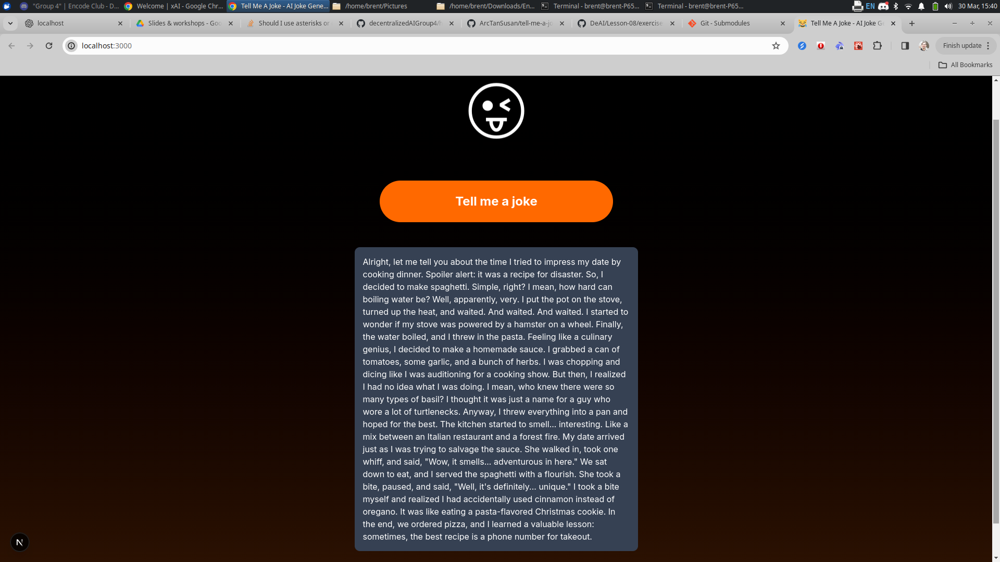

Weekend Project
To consolidate this week's learning, complete the following project:

* Create a GitHub repository for your project
* Add all group members as collaborators
* Create a README.md file with a comprehensive project description
* Use the LlamaIndex TypeScript Toolset as a foundation or develop a new application from scratch using Next.js
[Llama Index](https://www.llamaindex.ai/),[Llama Index TS](https://github.com/run-llama/LlamaIndexTS)
* Design a page with a single input field for .txt file uploads
* Users should upload a book or similar content with characters and settings
* Implement a button to extract characters from the uploaded file
* Develop a RAG pipeline to extract characters from the uploaded file [see 1:07:21 in lesson 16](https://www.youtube.com/watch?v=hU5FrT4woS8) , [rag-app](https://github.com/Encode-Club-AI-Bootcamp/DeAI/blob/main/Lesson-16/exercises/00-RAG-With-LlamaIndex.md)
* Each character should have a name, description, and personality [compare to joke telling app](https://github.com/ArcTanSusan/tell-me-a-joke)
* Add a text area below the button to display the results
* Convert the output from the AI into an array of objects and present it in a table format
- (optional) Use Structured Outputs to make it easier to process the textual responses in the pages
* Integrate the story-telling-app features to enable users to create new stories using imported characters, reusing their descriptions and personalities inside the stories being generated by the AI
  see: [story telling app modification lession 12](https://github.com/Encode-Club-AI-Bootcamp/DeAI/blob/main/Lesson-12/exercises/04-Story-Telling.md)
  see: [story telling app description lesson 8](https://github.com/Encode-Club-AI-Bootcamp/DeAI/blob/main/Lesson-08/exercises/04-Story-Telling.md)
* Submit your project through the designated submission form

## Story Telling App

## RAG APP

## Joke Telling App

